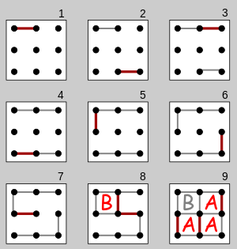

# Dots and Boxes Game

## Description
In this project, we implemented a game called <i>"Dots and Boxes"</i>, which is a strategically role-based game between 2 players. Therefore, we implemented the game following Server-Client architecture where players can compete against one another as long as they are connected to a same IP address and port. 

<b>Game rules: </b> Two players will players will take turns drawing a single line between two adjacent <i>"dots"</i>. The objective is to complete the fourth side of a 1x1 square or <i>"box"</i>. When a player completes one or more boxes, they earn as many points as they close boxes and take another turn. If a player does not complete a box, then their turn ends and the other player may draw a line. 

Players do not have to close boxes, even if this is possible. They may also choose to leave some boxes for the opponent to close, which can sometimes be a strategic advantage. The game continues until all lines are drawn and all boxes are completed. \
The player who has completed the most boxes at the end of the game is declared the winner. In the event that both players have completed an equal number of boxes, the game ends in a draw. 

If there is an odd number of boxes in the game, for example in 5x5 Dots and Boxes, then a draw is not possible.

## Table of Contents

- [Folder Structure](#folder-structure)
- [Build](#build)
- [Testing](#testing)
- [Documentation](#documentation)
- [Acknowledgements](#acknowledgements)

# Folder Structure

* in the src: contains all written codes for the program 
   * in the dotsandboxclient: we store the client's data as well as the AI client data 
   * in the exception: we handle our own exceptions 
   * in the ai: we have the files that are AI-related, which act as either naive or smart AI player 
   * in the model: contains the game logic, which consists of components that make up a complete board game
   * in the tui: act as the View perspective of MVC structure 
   * in the networking: we have all the files for the server and client communication 
   * in the server: we have files related to the server, which includes classes of ClientHandler, ServerConnection and the Server itself 
   * in the test: we have the test files for the game logic 
   * in the utils: we have a file that contains particularly pre-written functions for specific usage in the program 

# Testing
* Game logic \
The testing can be found at the test folder. Two seperate files are in this folder: one for the game and one for the board.
After running these two files, we can see that the board will initialize a game board with all specific fields. Later it checks if after filling in the field, it is actually filled, and also if we can create a box as well.
The game will then play two games, one with filling in all the lines with a single mark to check if the winner will be the player of that mark. After that, it will play a random game and it checks if the winner is returned correctly.

You can run these the test file by locating to the file's location and execute it.

# Build

1. Clone the repository: \
   $ git clone https://gitlab.utwente.nl/software-systems/2023-2024/student-projects/resit/resit-8/-/blob/main/README.md?ref_type=heads \
   $ cd dotsandboxes_resit8

In Intellij with CTRL+F9, you can build the project and then you can run the files by selecting them (the tests, GameClientTui and GameServer) and then press CTRL+F5.

# Documentation
* GAMEPLAY: 
As we are in a game, we can type in the command MOVE and press Enter, then we can enter a number for the move (in the form MOVE~<number>). In case a player is the one who completes a box (i.e., the one that fills the 4th edge), the game will mark the top line with that player's color (first player: red, second player: blue, while green indicates the edge being filled but  the box has not been taken by any player). The mark of the top line is the mark of the box, so in order to win the game, the player needs to obtain as many lines as possible until the game ends. 

* CLIENT:
The client firstly requests the IP address of the server. In case the server is hosted on the local machine, we can just type in "localhost". After that, we have to type in the port of the server, followed by a username of our choice (this has to be unique, else the game will request another one). Then we can type either QUEUE or LIST or EXIT, which will "list all players logged in", or "exit the program", or "queue the player up for a game" respectively. If the player is already in a queue, typing "QUEUE" will dequeue, which removes that person out of the queue. \
As soon as there are at least 2 players logged in, a game will automatically start, and players can then follow the steps of the GAMEPLAY. After the game ends, the player can QUEUE again to play more games, or simply EXIT to exit the program.

* AI CLIENT
The client requests the ip of the server, if we host the server we can just type in localhost. After that we have to type in the port of the server, followed by a username of our choice (this has to be unique, else the game will request another one). Then the AI will request us to choose a difficulty (-n for naive or -s for smart AI). After these steps, the AI will automatically queue and play a game.

* Server
Starting the server will only require us to type in a port number, or 0 for a randomly available port. 

# Acknowledgements
Made by : Koppány Heizer s2936011, and Khanh Nguyen s2950944
