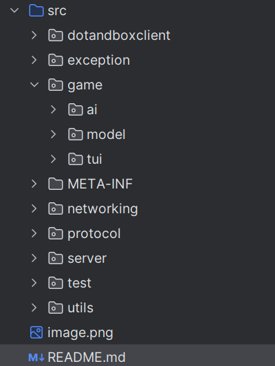

# Dots and Boxes Game - by resit-8

## Description
In this project we implemented a game called Dots and Boxes, and we also
made a client and server so the game can be played through the internet
as well

## Table of Contents

- [Folder Structure](#folder-structure)
- [Testing](#testing)
- [Documentation](#documentation)
- [Acknowledgements](#acknowledgements)

# Folder Structure

In the .idea and out folder Intellijs files are being stored so that the project is correctly handled
--in the src is the written code for the java
-- in the dotsandboxclient we store the client's data as well as the AI client data
-- in the exception we handle our own exceptions
-- in the ai we have the files for all the AI s both naive and smart
-- in the model we have the game logic
-- in the tui is the game interface
-- in the networking we have all the files for the netwroking part
-- in the server we have the client handlers the server connection and the server itself
-- in the test we have all the test files for the game logic
-- in the utils we have a java file to test code ideas

# Testing
--Gamelogic
The testing can be found at the testing folder. Two seperate files are in this folder one for the game and one for the board.
After running these two files we can see that the board will create a game board with all fields and add all the files to it, whilst also making them empty. Later it checks if after filling in the field, it is actually filled, and also if we can create a box as well and also to mark it correctly.
The game will then play two games, one with filling in all the lines with a single mark to check if the winner will be the player of that mark. After that it will play a random game and will check if the winner is correct.

# Documentation
--GAMEPLAY: 
after we are in a game, we can type in the command MOVE and press enter, then we can enter a number for the move (This in the tui will me a single command with the form MOVE~Number). The move will represent a line that we cann fill in. In case we filled in 4 lines that are the side of a box, the game will mark the top line with our color (first player: red, second: blue, green being filled but not taken). The mark of the top line is the mark of the box, this way in order to win the game we will need to fill in the most lines until the end of the game. 

--CLIENT:
the client requests the ip of the server, if we host the server we can just type in localhost. After that we have to type in the port of the server, followed by a username of our choice (this has to be unique else the game will request another one). The we can either QUEUE or LIST or EXIT, the list command will list all players logged in, the exit will exit the program, the QUEUE will queue us up for a game, or if we type it in again it will remove us from the queue or if we are in a game from the game. After we are in a game if its our turn (shown by the TUI). Then we can follow the steps of the GAMEPLAY. After the game end

--AI CLIENT
the client requests the ip of the server, if we host the server we can just type in localhost. After that we have to type in the port of the server, followed by a username of our choice (this has to be unique else the game will request another one). Then the ai will request us to choose a difficulty (-n for naive or -s for smart AI). After these steps the AI will automatically queue and play a game.

--Server
Starting the server will only require us to type in a port number, or 0 for a random port. Then we can view the connecting and disconnecting clients printed out by the server.

# Acknowledgements
Made by : Koppány Heizer s2936011, and Khan Nguyen s2950944
